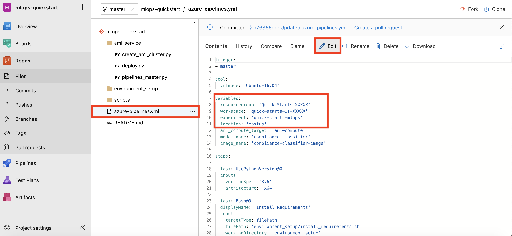
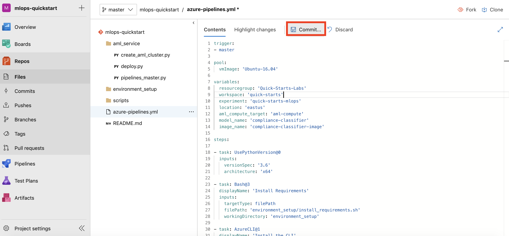
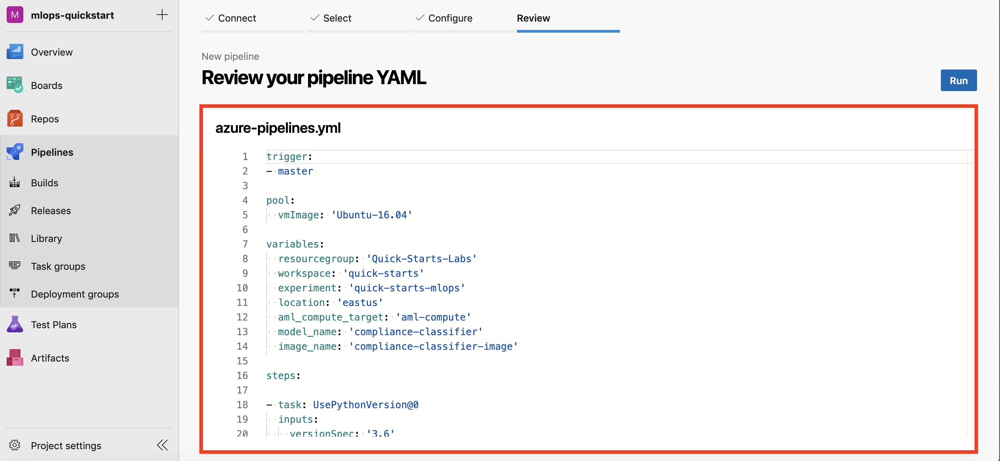
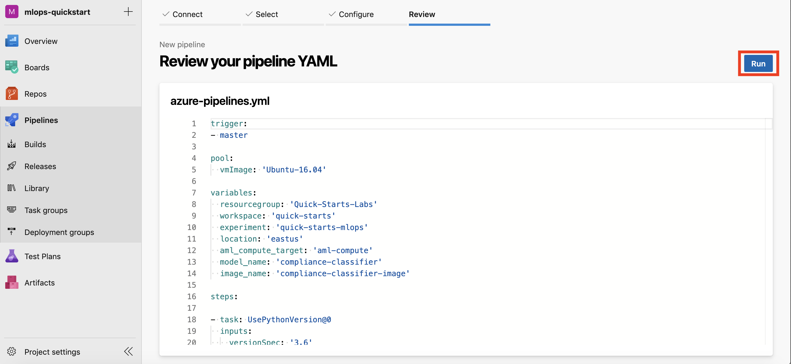
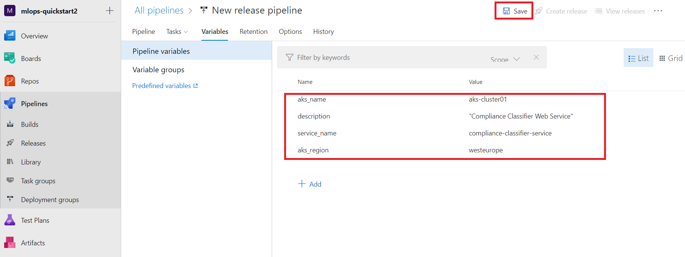
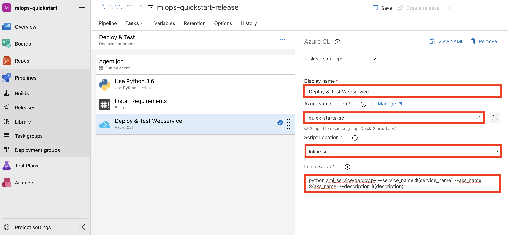
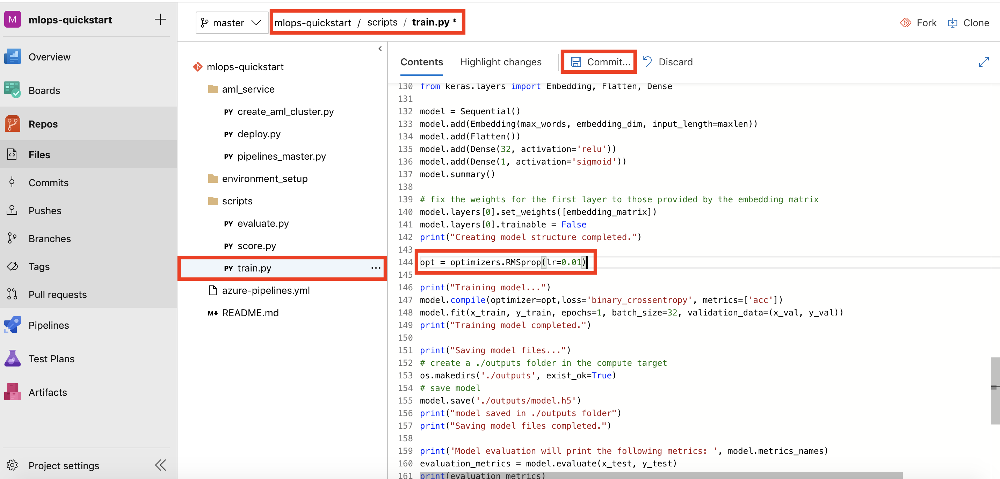

MLOps

Hands-on lab step-by-step

June 2019

Information in this document, including URL and other Internet Web site references, is subject to change without notice. Unless otherwise noted, the example companies, organizations, products, domain names, e-mail addresses, logos, people, places, and events depicted herein are fictitious, and no association with any real company, organization, product, domain name, e-mail address, logo, person, place or event is intended or should be inferred. Complying with all applicable copyright laws is the responsibility of the user. Without limiting the rights under copyright, no part of this document may be reproduced, stored in or introduced into a retrieval system, or transmitted in any form or by any means (electronic, mechanical, photocopying, recording, or otherwise), or for any purpose, without the express written permission of Microsoft Corporation.

Microsoft may have patents, patent applications, trademarks, copyrights, or other intellectual property rights covering subject matter in this document. Except as expressly provided in any written license agreement from Microsoft, the furnishing of this document does not give you any license to these patents, trademarks, copyrights, or other intellectual property.

The names of manufacturers, products, or URLs are provided for informational purposes only and Microsoft makes no representations and warranties, either expressed, implied, or statutory, regarding these manufacturers or the use of the products with any Microsoft technologies. The inclusion of a manufacturer or product does not imply endorsement of Microsoft of the manufacturer or product. Links may be provided to third party sites. Such sites are not under the control of Microsoft and Microsoft is not responsible for the contents of any linked site or any link contained in a linked site, or any changes or updates to such sites. Microsoft is not responsible for webcasting or any other form of transmission received from any linked site. Microsoft is providing these links to you only as a convenience, and the inclusion of any link does not imply endorsement of Microsoft of the site or the products contained therein.

© 2019 Microsoft Corporation. All rights reserved.

Microsoft and the trademarks listed at <https://www.microsoft.com/en-us/legal/intellectualproperty/Trademarks/Usage/General.aspx> are trademarks of the Microsoft group of companies. All other trademarks are property of their respective owners.

**Contents** 

<!-- TOC -->

- [MLOps hands-on lab step-by-step](#MLOps-hands-on-lab-step-by-step)
  - [Abstract and learning objectives](#Abstract-and-learning-objectives)
  - [Overview](#Overview)
  - [Solution architecture](#Solution-architecture)
  - [Requirements](#Requirements)
  - [Before the hands-on lab](#Before-the-hands-on-lab)
  - [Exercise 1: Creating and evaluating compliance classification models](#Exercise-1-Creating-and-evaluating-compliance-classification-models)
    - [Task 1: Create the classification model using a notebook](#Task-1-Create-the-classification-model-using-a-notebook)
  - [Exercise 2: Registering the model](#Exercise-2-Registering-the-model)
    - [Task 1: Register Model using Azure Machine Learning Python SDK](#Task-1-Register-Model-using-Azure-Machine-Learning-Python-SDK)
    - [Task 2: Register Model from Azure Portal](#Task-2-Register-Model-from-Azure-Portal)
  - [Exercise 3: Setup New Project in Azure DevOps](#Exercise-3-Setup-New-Project-in-Azure-DevOps)
    - [Task 1: Create New Project](#Task-1-Create-New-Project)
    - [Task 2: Import Quickstart code from a Github Repo](#Task-2-Import-Quickstart-code-from-a-Github-Repo)
    - [Task 3: Update the build YAML file](#Task-3-Update-the-build-YAML-file)
    - [Task 4: Create new Service Connection](#Task-4-Create-new-Service-Connection)
  - [Exercise 4: Setup and Run the Build Pipeline](#Exercise-4-Setup-and-Run-the-Build-Pipeline)
    - [Task 1: Setup Build Pipeline](#Task-1-Setup-Build-Pipeline)
    - [Task 2: Run the Build Pipeline](#Task-2-Run-the-Build-Pipeline)
    - [Task 3: Review Build Artifacts](#Task-3-Review-Build-Artifacts)
    - [Task 4: Review Build Outputs](#Task-4-Review-Build-Outputs)
  - [Exercise 5: Setup the Release Pipeline](#Exercise-5-Setup-the-Release-Pipeline)
    - [Task 1: Create an Empty Job](#Task-1-Create-an-Empty-Job)
    - [Task 2: Add Build Artifact](#Task-2-Add-Build-Artifact)
    - [Task 3: Add Variables to Deploy & Test stage](#Task-3-Add-Variables-to-Deploy--Test-stage)
    - [Task 4: Setup Agent Pool for Deploy & Test stage](#Task-4-Setup-Agent-Pool-for-Deploy--Test-stage)
    - [Task 5: Add Use Python Version task](#Task-5-Add-Use-Python-Version-task)
    - [Task 6: Add Install Requirements task](#Task-6-Add-Install-Requirements-task)
    - [Task 7: Add Deploy & Test Webservice task](#Task-7-Add-Deploy--Test-Webservice-task)
    - [Task 8: Define Deployment Trigger](#Task-8-Define-Deployment-Trigger)
    - [Task 9: Enable Continuous Deployment Trigger](#Task-9-Enable-Continuous-Deployment-Trigger)
    - [Task 10: Save the Release Pipeline](#Task-10-Save-the-Release-Pipeline)
  - [Exercise 6: Test Build and Release Pipelines](#Exercise-6-Test-Build-and-Release-Pipelines)
    - [Task 1: Make Edits to Source Code](#Task-1-Make-Edits-to-Source-Code)
    - [Task 2: Monitor Build Pipeline](#Task-2-Monitor-Build-Pipeline)
    - [Task 3: Monitor Release Pipeline](#Task-3-Monitor-Release-Pipeline)
    - [Task 4: Review Release Pipeline Outputs](#Task-4-Review-Release-Pipeline-Outputs)
  - [Exercise 7: Testing the deployed solution](#Exercise-7-Testing-the-deployed-solution)
    - [Task 1: Test the Deployment](#Task-1-Test-the-Deployment)
  - [Exercise 8: Examining deployed model performance](#Exercise-8-Examining-deployed-model-performance)
    - [Task 1: Activate App Insights and data collection on the deployed model](#Task-1-Activate-App-Insights-and-data-collection-on-the-deployed-model)
    - [Task 2: Check Application Insights telemetry](#Task-2-Check-Application-Insights-telemetry)
    - [Task 3: Check the data collected](#Task-3-Check-the-data-collected)
  - [After the hands-on lab](#After-the-hands-on-lab)
    - [Task 1: Clean up lab resources](#Task-1-Clean-up-lab-resources)

<!-- /TOC -->

# MLOps hands-on lab step-by-step 

## Abstract and learning objectives 

In this hands-on lab, you will learn how Trey Research can leverage Deep Learning technologies to scan through their vehicle specification documents to find compliance issues with new regulations. You will standardize the model format to ONNX and observe how this simplifies inference runtime code, enabling pluggability of different models and targeting a broad range of runtime environments and most importantly improves inferencing speed over the native model. You will build a DevOps pipeline the coordinate retrieving the latest best model from the model registry, packaging the web application, deploying the web application and inferencing web service. After a first successful deployment, you will make updates to both the model and the and web application and execute the pipeline once for to achieve an updated deployment. You will also learn how to monitor the model's performance after it is deployed so Trey Research can be proactive with performance issues.

At the end of this hands-on lab, you will be better able to you will be better able to implement end-to-end solutions that fully operationalize deep learning models, inclusive of all application components that depend on the model.

## Overview

Trey Research Inc. delivers innovative solutions for manufacturers. They specialize in identifying and solving problems for manufacturers that can run the range from automating away mundane but time-intensive processes to delivering cutting edge approaches that provide new opportunities for their manufacturing clients. Trey Research has decades specializing in data science and application development that until now were separate units. They have seen the value created by the ad-hoc synergies between data science and app development, but they would like to unlock the greater, long term value as they formalize their approach by combining the two units into one, and follow one standardized process for operationalizing their innovations.

As their first effort of this combined initiative, they would to define a process for operationalizing deep learning that encompasses all phases of the application life cycle along with model creation and deployment of a deep learning model. For this first proof of concept, they would like to focus on component compliance. Specifically they are looking to leverage Deep Learning technologies with Natural Language Processing techniques to scan through vehicle specification documents to find compliance issues with new regulations. Even though this first scenario is focused on vehicle components, they believe this approach will generalize to any scenario involving an inventory of components (which all of their manufacturing customers deal with). The component descriptions (which are free form text) are entered and managed via a web application. This web application take new component descriptions entered by authorized technicians and labels the component as compliant or non-compliant based on the text. 

They want to ensure the overall process they create enables them to update both the underlying model and the web app in one, unified pipeline. They also want to be able to monitor the model's performance after it is deployed so they can be proactive with performance issues.

## Solution architecture

The overall approach used in this lab is to orchestrate continuous integration and continuous delivery Azure Pipelines from Azure DevOps. These pipelines are triggered by changes to artifacts that describe a machine learning pipeline, that is created with the Azure Machine Learning SDK. In the lab, you make a change to the model training script that executes the Azure Pipelines Build Pipeline, which trains the model and creates the container image. Then this triggers an Azure Pipelines Release pipeline that deploys the model as a web service to AKS, by using the Docker image that was created in the Build pipeline. Once in production, the scoring web service is monitored using a combination of Application Insights and Azure Storage.

## Requirements

1.  Microsoft Azure subscription must be pay-as-you-go or MSDN

    a. Trial subscriptions will not work. You will run into issues with Azure resource quota limits.

    b. Subscriptions with access limited to a single resource group will not work. You will need the ability to deploy multiple resource groups.

2. An Azure DevOps account.

## Before the hands-on lab

Refer to the Before the hands-on lab setup guide manual before continuing to the lab exercises.

To author: remove this section if you do not require environment setup instructions.

## Exercise 1: Creating and evaluating compliance classification models

Duration: 40 minutes

In this exercise, you create a model for classifying component text as compliant or non-compliant.

### Task 1: Create the classification model using a notebook

1. Browse to your Azure Notebooks project and navigate to `Deep Learning with Text.ipynb`. This is the notebook you will step thru executing in this lab.
2. Follow the instructions within the notebook to complete the lab.
3. In Azure Notebooks navigate to the `models` folder and download the **model.h5** file to your local disk. We will use the downloaded model file in the next exercise. *Note that if the downloaded file name is changed to `utf-8''model.h5`, then rename the file back to `model.h5`*

    **Note**: The **model.h5** file is generated during the execution of the notebook at the previous step (step 2). When running the notebook, make sure the execution is successfull and the file is correctly created.

## Exercise 2: Registering the model

Duration: 15 minutes

In this exercise, you explore the approaches you can take to managing the model versions, their association with Experiment Runs, and how you can retrieve the models both programmatically and via the Azure Portal.

### Task 1: Register Model using Azure Machine Learning Python SDK

1. Browse to your Azure Notebooks project and navigate to `Register Model.ipynb`. This is the notebook you will step thru executing in this lab.
2. Follow the instructions within the notebook to complete the lab.
3. Log in to [Azure Portal](https://portal.azure.com). Open your **Resource Group, Workspace, Models** section, and observe the **version 1** of the registered model: `compliance-classifier`.

    
    
### Task 2: Register Model from Azure Portal

1. Log in to [Azure Portal](https://portal.azure.com). Open your **Resource Group, Workspace, Models** section and select **Add Model**

  
  
2. Provide the following input to the `Register a Model page`, and then select **Create**

   a. Name: `compliance-classifier`
   
   b. Description: `Deep learning model to classify the descriptions of car components as compliant or non-compliant.`
   
   c. Select the `model.h5` file from your local disk.

   
   
3. Navigate to your **Resource Group, Workspace, Models** section, and observe the **version 2** of the registered model: `compliance-classifier`.

  

## Exercise 3: Setup New Project in Azure DevOps

Duration: 20 minutes

### Task 1: Create New Project

1. Sign in to [Azure DevOps](http://dev.azure.com)
2. Select **Create project**

    

3. Provide Project Name: `mlops-quickstart` and select **Create**

    

### Task 2: Import Quickstart code from a Github Repo

1. Within the new project:

   a. Select **Repos** from left navigation bar
   
   b. Select **Import** from the content section
   
      
   
2. Provide the following Github URL: `https://github.com/solliancenet/mcw-mlops-starter` and select **Import**. This should import the code required for the quickstart.

    

### Task 3: Update the build YAML file

1. Select and open the `azure-pipelines.yml` file
2. Select **Edit** and update the following variables: `resourcegroup`, and `workspace`. If you are using your own Azure subscription, please provide names to use. If an environment is provided to you be sure to replace XXXXX in the values below with your unique identifier.

    

3. Select **Commit** to save your changes.

    
  
### Task 4: Create new Service Connection

1. From the left navigation select **Project settings** and then select **Service connections**

    

2. Select **New service connection** and then select **Azure Resource Manager**

    

3. Provide the following information in the `Add an Azure Resource Manager service connection` dialog box and then select **Ok**:
 
   a. Connection name: `quick-starts-sc`
   
   b. Subscription: Select the Azure subscription to use

   **Note**

   It might take up to 30 seconds for the **Subscription** dropdown to be populated with available subscriptions, depending on the number of different subscriptions your account has access to.
   
   c. Resource Group: This value should match the value you provided in the `azure-pipelines.yml` file
   
    

## Exercise 4: Setup and Run the Build Pipeline

Duration: 25 minutes

### Task 1: Setup Build Pipeline

1. From left navigation select **Pipelines, Builds** and then select **New pipeline**

    
    
2. Select **Azure Repos Git** as your code repository

    

3. Select **mlops-quickstart** as your repository

    

4. Review the YAML file

    The build pipeline has four key steps:
    
    a. Attach folder to workspace and experiment. This command creates the `.azureml` subdirectory that contains a `config.json` file that is used to communicate with your Azure Machine Learning workspace. All subsequent steps rely on the `config.json` file to instantiate the workspace object.
    
    b. Create the AML Compute target to run your master pipeline for model training and model evaluation.
    
    c. Run the master pipeline. The master pipeline has two steps: (1) Train the machine learning model, and (2) Evaluate the trained machine learning model. The evaluation step evaluates if the new model performance is better than the currently deployed model. If the new model performance is improved, the evaluate step will create a new Image for deployment. The results of the evaluation step will be saved in a file called `eval_info.json` that will be made available for the release pipeline. You can review the code for the master pipeline and its steps in `aml_service/pipelines_master.py`,  `scripts/train.py`, and `scripts/evaluate.py`.
    
    d. Publish the build artifacts. The `snapshot of the repository`, `config.json`, and `eval_info.json` files are published as build artifacts and thus can be made available for the release pipeline.

    

### Task 2: Run the Build Pipeline

1. Select **Run** to start running your build pipeline

    

2. Monitor the build run. The build pipeline, for the first run, will take around 15-20 minutes to run.

    

### Task 3: Review Build Artifacts

1. The build will publish an artifact named `devops-for-ai`. Select **Artifacts, devops-for-ai** to review the artifact contents.

    

2. Select **outputs, eval_info.json** and then select **Download**. The `eval_info.json` is the output from the *model evaluation* step and the information from the evaluation step will be later used in the release pipeline to deploy the model. Select **Close** to close the dialog.

    

3. Open the `eval_info.json` in a json viewer or a text editor and observe the information. The json output contains information such as if the model passed the evaluation step (`deploy_model`: *true or false*), and the name and id of the created image (`image_name` and `image_id`) to deploy.

    

### Task 4: Review Build Outputs

1. Log in to [Azure Portal](https://portal.azure.com). Open your **Resource Group, Workspace, Models** section, and observe the registered model: `compliance-classifier`.

    

2. Open your **Resource Group, Workspace, Images** section and observe the deployment image created during the build pipeline: `compliance-classifier-image`.

    
    
    
## Exercise 5: Setup the Release Pipeline

Duration: 20 minutes

### Task 1: Create an Empty Job

1. Return to Azure DevOps and navigate to **Pipelines, Releases** and select **New pipeline**

    

2. Select **Empty job**

    

3. Provide Stage name: `Deploy & Test` and close the dialog.

    

### Task 2: Add Build Artifact

1. Select **Add an artifact**

    

2. Select Source type: `Build`, Source (build pipeline): `mlops-quickstart`. *Observe the note that shows that the mlops-quickstart publishes the build artifact named devops-for-ai*. Finally, select **Add**

    
    
### Task 3: Add Variables to Deploy & Test stage

1. Open **View stage tasks** link

    

2. Open **Variables** tab

    

3. Add three Pipeline variables as name - value pairs and then select **Save**:

    a. Name: `aks_name` Value: `aks-cluster01`
    
    b. Name: `description` Value: `"Compliance Classifier Web Service"` *note the double quotes around description value*
    
    c. Name: `service_name` Value: `compliance-classifier-service`

    d. Name: `aks_region` Value: `eastus`

    **Note**

    The name of the Azure region should be the same one that was used to create Azure Machine Learning workspace earlier on.
    
      
      
### Task 4: Setup Agent Pool for Deploy & Test stage
        
1. Open **Tasks** tab

    
    
2. Select **Agent job** and change **Agent pool** to `Hosted Ubuntu 1604`

    
    
### Task 5: Add Use Python Version task

1. Select **Add a task to Agent job**, search for `Use Python Version`, and select **Add**

    

2. Provide **Display name:** `Use Python 3.6` and **Version spec:** `3.6`

    
    
### Task 6: Add Install Requirements task

1. Select **Add a task to Agent job**, search for `Bash`, and select **Add**
    
    

2. Provide **Display name:** `Install Requirements` and select **object browser ...** to provide **Script Path**.

    

3. Navigate to **Linked artifacts/_mlops-quickstart/devops-for-ai/environment_setup** and select **install_requirements.sh**

    

4. Expand **Advanced** and select **object browser ...** to provide **Working Directory**.

    
    
5. Navigate to **Linked artifacts/_mlops-quickstart/devops-for-ai** and select **environment_setup**

    
    
### Task 7: Add Deploy & Test Webservice task
    
1. Select **Add a task to Agent job**

    
    
2. Search for `Azure CLI`, and select **Add**

    

3. Provide the following information for the Azure CLI task:

    a. Display name: `Deploy & Test Webservice`
    
    b. Azure subscription: `quick-starts-sc` *This is the service connection we created in Exercise 1 / Task 4*
    
    c. Script Location: `Inline script`
    
    d. Inline Script: `python aml_service/deploy.py --service_name $(service_name) --aks_name $(aks_name) --aks_region $(aks_region) --description $(description)`
    
      

4. Expand **Advanced** and provide **Working Directory:** `$(System.DefaultWorkingDirectory)/_mlops-quickstart/devops-for-ai`

    
    

Please review the code in `aml_service/deploy.py`. This step will read the `eval_info.json` and if the evaluation step recommended to deploy the new trained model, it will deploy the new model to production in an **Azure Kubernetes Service (AKS)** cluster.

### Task 8: Define Deployment Trigger

1. Navigate to **Pipeline** tab, and select **Pre-deployment conditions** for the `Deploy & Test` stage
2. Select **After release**

    

3. Close the dialog

### Task 9: Enable Continuous Deployment Trigger

1. Select **Continuous deployment trigger** for `_mlops-quickstart` artifact
2. Enable: **Creates a release every time a new build is available.**

    
    
3. Close the dialog

### Task 10: Save the Release Pipeline

1. Provide name: `mlops-quickstart-release`
2. Select: **Save**

    

3. Select: **Ok**

    
    
## Exercise 6: Test Build and Release Pipelines

Duration: 30 minutes

### Task 1: Make Edits to Source Code

1. Navigate to: **Repos -> Files -> scripts -> train.py**
2. **Edit** `train.py`
3. Change the **learning rate (lr)** for the optimizer from **0.1** to **0.01**
4. Select **Commit**

    
    
5. Provide comment: `Improving model performance: changed learning rate.` and select **Commit**

    
    
### Task 2: Monitor Build Pipeline

1. Navigate to **Pipelines, Builds**. Observe that the CI build is triggered because of the source code change. 

   
   
2. Select the pipeline run and monitor the pipeline steps. The pipeline will run for 10-12 minutes. Proceed to the next task when the build pipeline successfully completes.
    
   

### Task 3: Monitor Release Pipeline

1. Navigate to **Pipelines, Releases**. Observe that the Release pipeline is automatically trigger upon successful completion of the build pipeline. Select as shown in the figure to view pipeline logs. 
    
   
   
2. The release pipeline will run for about 15 minutes. Proceed to the next task when the release pipeline successfully completes.

### Task 4: Review Release Pipeline Outputs

1. From the pipeline logs view, select **Deploy & Test Webservice** task to view details.

    
    
2. Observe the **Scoring URI** and **API Key** for the deployed webservice. Please note down both the `Scoring URI` and `API Key` for *Exercise 7*.

    

3. Log in to Azure Portal. Open your **Resource Group, Workspace, Deployments** section, and observe the deployed webservice: **compliance-classifier-service**.

    

## Exercise 7: Testing the deployed solution

Duration: 15 minutes

In this exercise, you verify that the first release of the application works.

### Task 1: Test the Deployment

1. Browse to your Azure Notebooks project and navigate to `Test Deployment.ipynb`. This is the notebook you will step thru executing in this lab.
2. Follow the instructions within the notebook to complete the lab.
3. Note that you will have to provide values for **Scoring URI** and **API Key** for the deployed webservice in the notebook.
 

## Exercise 8: Examining deployed model performance

Duration: 15 minutes

In this exercise you learn how to monitor the performance of a deployed model.

### Task 1: Activate App Insights and data collection on the deployed model

1. Browse to your Azure Notebooks project and navigate to the [Model Telemetry](notebooks/Model%20Telemetry.ipynb) notebook. This is the notebook you will step thru executing in this task.
2. Follow the instructions within the notebook to complete the task. When finished, your deployed model has now both [Application Insights](https://docs.microsoft.com/en-us/azure/azure-monitor/app/app-insights-overview) integration and data collection activated.

### Task 2: Check Application Insights telemetry

1. Navigate to the Azure Portal and locate the resource group you created for this lab (the one where the Azure Machine Learning service workspace was created in).
2. Locate the Application Insights instance in the resource group and click on it.

    

3. Go to **Overview**
4. From the top row of the right section select **Logs (Analytics)**. This will open the Application Insights query editor with an empty new query.

    

5. In the left pane, make sure the **Schema** tab is selected. 
6. Hover over **requests** and click the icon on the right side - "Show sample records from this table". 

    

7. Look at the results displayed. Application Insights is tracing all requests made to your model. Sometimes, a couple of minutes are needed for the telemetry information to propagate. If there are no results displayed, wait a minute, call again your model, and click **Run** to re-execute the Application Insights query.

    

### Task 3: Check the data collected

1. Navigate to the Azure Portal and locate the resource group you created for this lab (the one where the Azure Machine Learning service workspace was created in).
2. Locate the Storage Account instance in the resource group and click on it.

    

3. Go to **Storage Explorer (preview)**.
4. Expand the **BLOB CONTAINERS** section and identify the **modeldata** container

     

5. Identify the CSV files containing the collected data. The path to the output blobs is based on the following structure:

    `modeldata -> subscriptionid -> resourcegroup -> workspace -> webservice -> model -> version -> identifier -> year -> month -> day -> data.csv`

    

## After the hands-on lab 

Duration: 5 minutes

To avoid unexpected charges, it is recommended that you clean up all of your lab resources when you complete the lab.

### Task 1: Clean up lab resources

1.  Navigate to the Azure Portal and locate the `MCW-AI-Lab` Resource Group you created for this lab.

2.  Select **Delete resource group** from the command bar.

    

3.  In the confirmation dialog that appears, enter the name of the resource group and select **Delete**.

4.  Wait for the confirmation that the Resource Group has been successfully deleted. If you don't wait, and the delete fails for some reason, you may be left with resources running that were not expected. You can monitor using the Notifications dialog, which is accessible from the Alarm icon.

    

5.  When the Notification indicates success, the cleanup is complete.

    

You should follow all steps provided _after_ attending the Hands-on lab.

