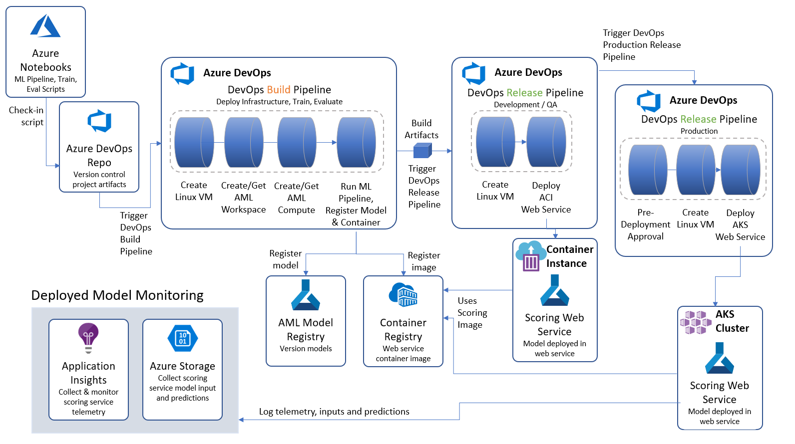

MLOps

Whiteboard design session trainer guide

June 2019

Information in this document, including URL and other Internet Web site references, is subject to change without notice. Unless otherwise noted, the example companies, organizations, products, domain names, e-mail addresses, logos, people, places, and events depicted herein are fictitious, and no association with any real company, organization, product, domain name, e-mail address, logo, person, place or event is intended or should be inferred. Complying with all applicable copyright laws is the responsibility of the user. Without limiting the rights under copyright, no part of this document may be reproduced, stored in or introduced into a retrieval system, or transmitted in any form or by any means (electronic, mechanical, photocopying, recording, or otherwise), or for any purpose, without the express written permission of Microsoft Corporation.

Microsoft may have patents, patent applications, trademarks, copyrights, or other intellectual property rights covering subject matter in this document. Except as expressly provided in any written license agreement from Microsoft, the furnishing of this document does not give you any license to these patents, trademarks, copyrights, or other intellectual property.

The names of manufacturers, products, or URLs are provided for informational purposes only and Microsoft makes no representations and warranties, either expressed, implied, or statutory, regarding these manufacturers or the use of the products with any Microsoft technologies. The inclusion of a manufacturer or product does not imply endorsement of Microsoft of the manufacturer or product. Links may be provided to third party sites. Such sites are not under the control of Microsoft and Microsoft is not responsible for the contents of any linked site or any link contained in a linked site, or any changes or updates to such sites. Microsoft is not responsible for webcasting or any other form of transmission received from any linked site. Microsoft is providing these links to you only as a convenience, and the inclusion of any link does not imply endorsement of Microsoft of the site or the products contained therein.

© 2019 Microsoft Corporation. All rights reserved.

Microsoft and the trademarks listed at <https://www.microsoft.com/en-us/legal/intellectualproperty/Trademarks/Usage/General.aspx> are trademarks of the Microsoft group of companies. All other trademarks are property of their respective owners.

**Contents**

<!-- TOC -->

- [Trainer information](#Trainer-information)
  - [Role of the trainer](#Role-of-the-trainer)
  - [Whiteboard design session flow](#Whiteboard-design-session-flow)
  - [Before the whiteboard design session: How to prepare](#Before-the-whiteboard-design-session-How-to-prepare)
  - [During the whiteboard design session: Tips for an effective whiteboard design session](#During-the-whiteboard-design-session-Tips-for-an-effective-whiteboard-design-session)
- [MLOps whiteboard design session student guide](#MLOps-whiteboard-design-session-student-guide)
  - [Abstract and learning objectives](#Abstract-and-learning-objectives)
  - [Step 1: Review the customer case study](#Step-1-Review-the-customer-case-study)
    - [Customer situation](#Customer-situation)
    - [Customer needs](#Customer-needs)
    - [Customer objections](#Customer-objections)
    - [Infographic for common scenarios](#Infographic-for-common-scenarios)
  - [Step 2: Design a proof of concept solution](#Step-2-Design-a-proof-of-concept-solution)
  - [Step 3: Present the solution](#Step-3-Present-the-solution)
  - [Wrap-up](#Wrap-up)
- [MLOps whiteboard design session trainer guide](#MLOps-whiteboard-design-session-trainer-guide)
  - [Step 1: Review the customer case study](#Step-1-Review-the-customer-case-study-1)
  - [Step 2: Design a proof of concept solution](#Step-2-Design-a-proof-of-concept-solution-1)
  - [Step 3: Present the solution](#Step-3-Present-the-solution-1)
  - [Wrap-up](#Wrap-up-1)
  - [Preferred target audience](#Preferred-target-audience)
  - [Preferred solution](#Preferred-solution)
  - [Checklist of preferred objection handling](#Checklist-of-preferred-objection-handling)
  - [Customer quote (to be read back to the attendees at the end)](#Customer-quote-to-be-read-back-to-the-attendees-at-the-end)

<!-- /TOC -->

# Trainer information

Thank you for taking time to support the whiteboard design sessions as a trainer!

## Role of the trainer

An amazing trainer:

-   Creates a safe environment in which learning can take place.

-   Stimulates the participant's thinking.

-   Involves the participant in the learning process.

-   Manages the learning process (on time, on topic, and adjusting to benefit participants).

-   Ensures individual participant accountability.

-   Ties it all together for the participant.

-   Provides insight and experience to the learning process.

-   Effectively leads the whiteboard design session discussion.

-   Monitors quality and appropriateness of participant deliverables.

-   Effectively leads the feedback process.

## Whiteboard design session flow 

Each whiteboard design session uses the following flow:

**Step 1: Review the customer case study (15 minutes)**

**Outcome**

Analyze your customer's needs.

-   Customer's background, situation, needs and technical requirements

-   Current customer infrastructure and architecture

-   Potential issues, objectives and blockers

**Step 2: Design a proof of concept solution (60 minutes)**

**Outcome**

Design a solution and prepare to present the solution to the target customer audience in a 15-minute chalk-talk format.

-   Determine your target customer audience.

-   Determine customer's business needs to address your solution.

-   Design and diagram your solution.

-   Prepare to present your solution.

**Step 3: Present the solution (30 minutes)**

**Outcome**

Present solution to your customer:

-   Present solution

-   Respond to customer objections

-   Receive feedback

**Wrap-up (15 minutes)**

-   Review preferred solution

## Before the whiteboard design session: How to prepare

Before conducting your first whiteboard design session:

-   Read the Student guide (including the case study) and Trainer guide.

-   Become familiar with all key points and activities.

-   Plan the point you want to stress, which questions you want to drive, transitions, and be ready to answer questions.

-   Prior to the whiteboard design session, discuss the case study to pick up more ideas.

-   Make notes for later.

## During the whiteboard design session: Tips for an effective whiteboard design session

**Refer to the Trainer guide** to stay on track and observe the timings.

**Do not expect to memorize every detail** of the whiteboard design session.

When participants are doing activities, you can **look ahead to refresh your memory**.

-   **Adjust activity and whiteboard design session pace** as needed to allow time for presenting, feedback, and sharing.

-   **Add examples, points, and stories** from your own experience. Think about stories you can share that help you make your points clearly and effectively.

-   **Consider creating a "parking lot"** to record issues or questions raised that are outside the scope of the whiteboard design session or can be answered later. Decide how you will address these issues, so you can acknowledge them without being derailed by them.

***Have fun**! Encourage participants to have fun and share!*

**Involve your participants.** Talk and share your knowledge but always involve your participants, even while you are the one speaking.

**Ask questions** and get them to share to fully involve your group in the learning process.

**Ask first**, whenever possible. Before launching into a topic, learn your audience's opinions about it and experiences with it. Asking first enables you to assess their level of knowledge and experience, and leaves them more open to what you are presenting.

**Wait for responses**. If you ask a question such as, "What's your experience with (fill in the blank)?" then wait. Do not be afraid of a little silence. If you leap into the silence, your participants will feel you are not serious about involving them and will become passive. Give participants a chance to think, and if no one answers, patiently ask again. You will usually get a response.

#  MLOps whiteboard design session student guide

## Abstract and learning objectives 

In this workshop, you will learn how Trey Research can leverage Deep Learning technologies to scan through their vehicle specification documents to find compliance issues with new regulations, and manage the classification thru their web application. The entire process from model creation, application packaging, model deployment and application deployment needs to occur as one unified repeatable, pipeline. 

At the end of this workshop, you will be better able to design and implement end-to-end solutions that fully operationalize deep learning models, inclusive of all application components that depend on the model.

## Step 1: Review the customer case study 

**Outcome**

Analyze your customer's needs.

Timeframe: 15 minutes

Directions:  With all participants in the session, the facilitator/SME presents an overview of the customer case study along with technical tips.

1.  Meet your table participants and trainer.

2.  Read all of the directions for steps 1-3 in the student guide.

3.  As a table team, review the following customer case study.

### Customer situation

Trey Research Inc. delivers innovative solutions for manufacturers. They specialize in identifying and solving problems for manufacturers that can run the range from automating away mundane but time-intensive processes to delivering cutting edge approaches that provide new opportunities for their manufacturing clients. Trey Research has decades specializing in data science and application development that until now were separate units. They have seen the value created by the ad-hoc synergies between data science and app development, but they would like to unlock the greater, long term value as they formalize their approach by combining the two units into one, and follow one standardized process for operationalizing their innovations.

As their first effort of this combined initiative, they would to define a process for operationalizing deep learning that encompasses all phases of the application life cycle along with model creation and deployment of a deep learning model. For this first proof of concept, they would like to focus on component compliance. Specifically they are looking to leverage Deep Learning technologies with Natural Language Processing techniques to scan through vehicle specification documents to find compliance issues with new regulations. Even though this first scenario is focused on vehicle components, they believe this approach will generalize to any scenario involving an inventory of components (which all of their manufacturing customers deal with). The component descriptions (which are free form text) are entered and managed via a web application. This web application take new component descriptions entered by authorized technicians and labels the component as compliant or non-compliant based on the text. For the PoC, they have exported all of their labeled component descriptions as flat files (CSV format).

According to Francine Fischer, CIO of Trey Research, they want to ensure the overall process they create enables them to update both the underlying model and the web app in one using a standardized approach. They also want to be able to monitor the model's performance after it is deployed so they can be proactive with performance issues. They believe they can accomplish most, if not all, of this using Azure Machine Learning but are wanting to be certain.

Finally, Trey would like to ensure that the process they establish is not littered with username and password credentials used to access the component used during build and release.

### Customer needs 

1.  Want to understand the best practice process they should follow for end-to-end deployment of deep learning models.

2.  Need a solution that addresses the management of the entire model lifecycle, inclusive of monitoring the model in production and being able re-train and re-deploy when a model needs updating.

3.  A process that avoids checking credentials into source control.

### Customer objections 

1.  We are not clear about the benefits that using ONNX might bring to our current scenario and future scenario.

2.  It seems like data scientists deploy their models as web services from their own python scripts, where as our developers are accustomed to using Azure DevOps to deploy their web services. Can we really have one tool that provides us build and deployment pipelines irrespective of whether we are deploying a model or web application code?

3.  Obviously, we can't just have new models automatically deployed into production. What kind of safeguards can we put in place?

### Infographic for common scenarios

## Step 2: Design a proof of concept solution

**Outcome**

Design a solution and prepare to present the solution to the target customer audience in a 15-minute chalk-talk format.

Timeframe: 60 minutes

**Business needs**

Directions: With all participants at your table, answer the following questions and list the answers on a flip chart:

1.  Who should you present this solution to? Who is your target customer audience? Who are the decision makers?

2.  What customer business needs do you need to address with your solution?

**Design**

Directions: With all participants at your table, respond to the following questions on a flip chart:

*High-level architecture*

1.  Without getting into the details (the following sections will address the details), diagram your initial vision for the solution. You will refine this diagram as you proceed.

*Component Classification*

1.  What is the general pipeline for approaching the training of text analytic models such as this? What are the general steps you need to take to prepare the text data for performing tasks like classification?

2.  Provided that Trey wants to build the PoC using Azure Machine Learning, what is the first item they would want to deploy in Azure? 

3.  Within the above deployed item, what component would they use to orchestrate the various **machine learning** phases (specifically data access, model training and model evaluation)? Be specific about which programming language and framework or SDK they would use.

4.  Where would they author any scripts?

5. Where should Trey upload the component compliance data?

6.  Describe at a high level the objects involved in the scripted pipeline you would create for training the compliance classification model using Azure Machine Learning.

7.  Diagram what happens when you run a machine learning pipeline in Azure Machine Learning.

*Enabling DevOps for AI with MLOps*

1.  Building on the approach you suggested to Trey for machine learning pipelines, what would you propose they use to fold them into a bigger DevOps pipeline for continuous integration and delivery that would result in a new scoring web service being deployed whenever there was a change to the code supporting model training. 

2.  In your Azure Pipelines design, give an example of what would trigger the execution of the pipeline?

3.  What type of Azure Pipeline would be triggered first in response (Build or Release)? 

4.  What are the core steps in this first pipeline? What does the pipeline output?

5.  After the first pipeline, what kind of Azure Pipeline would Trey define to deploy the scoring web service? What are the core steps in this pipeline? What does the pipeline output?

6.  How would Trey modify the aforementioned deployment pipeline to enforce that a manual sign-off is performed before the web service could be deployed into the production environment?

7.  How could Trey configure their Azure Pipelines so as to avoid hardcoding credentials to access Azure resources?

*Monitoring in Production*

1.  How would you recommend Trey collect diagnostics of the scoring web service in production?

2.  How can Trey collect the data input to the scoring web service and the outputs that result, such that they could monitor how the model is performing in production?

**Prepare**

Directions: With all participants at your table:

1.  Identify any customer needs that are not addressed with the proposed solution.

2.  Identify the benefits of your solution.

3.  Determine how you will respond to the customer's objections.

Prepare a 15-minute chalk-talk style presentation to the customer.

## Step 3: Present the solution

**Outcome**

Present a solution to the target customer audience in a 15-minute chalk-talk format.

Timeframe: 30 minutes

**Presentation**

Directions:

1.  Pair with another table.

2.  One table is the Microsoft team and the other table is the customer.

3.  The Microsoft team presents their proposed solution to the customer.

4.  The customer makes one of the objections from the list of objections.

5.  The Microsoft team responds to the objection.

6.  The customer team gives feedback to the Microsoft team.

7.  Tables switch roles and repeat Steps 2-6.

##  Wrap-up 

Timeframe: 15 minutes

Directions: Tables reconvene with the larger group to hear the facilitator/SME share the preferred solution for the case study.

|    |            |
|----------|:-------------:|
| **Description** | **Links** |
|Azure Machine Learning documentation|https://docs.microsoft.com/en-us/azure/machine-learning/service/|
|Azure Machine Learning - How to enable App Insights| https://docs.microsoft.com/en-us/azure/machine-learning/service/how-to-enable-app-insights |
|Azure Machine Learning - How to enable data collection |https://docs.microsoft.com/en-us/azure/machine-learning/service/how-to-enable-data-collection|
|Machine Learning Pipelines|https://docs.microsoft.com/en-us/azure/machine-learning/service/how-to-create-your-first-pipeline?view=azure-devops|
|Azure Pipelines - Train and deploy machine learning models|https://docs.microsoft.com/en-us/azure/devops/pipelines/targets/azure-machine-learning?context=azure%2Fmachine-learning%2Fservice%2Fcontext%2Fml-context&view=azure-devops|
|Azure DevOps Release Approvals and Gates| https://docs.microsoft.com/en-us/azure/devops/pipelines/release/approvals/index?view=azure-devops |

# MLOps whiteboard design session trainer guide

## Step 1: Review the customer case study

-   Check in with your table participants to introduce yourself as the trainer.

-   Ask, "What questions do you have about the customer case study?"

-   Briefly review the steps and timeframes of the whiteboard design session.

-   Ready, set, go! Let the table participants begin.

## Step 2: Design a proof of concept solution

-   Check in with your tables to ensure that they are transitioning from step to step on time.

-   Provide some feedback on their responses to the business needs and design.

    -   Try asking questions first that will lead the participants to discover the answers on their own.

-   Provide feedback for their responses to the customer's objections.

    -   Try asking questions first that will lead the participants to discover the answers on their own.

## Step 3: Present the solution

-   Determine which table will be paired with your table before Step 3 begins.

-   For the first round, assign one table as the presenting team and the other table as the customer.

-   Have the presenting team present their solution to the customer team.

    -   Have the customer team provide one objection for the presenting team to respond to.

    -   The presentation, objections, and feedback should take no longer than 15 minutes.

    -   If needed, the trainer may also provide feedback.

## Wrap-up

-   Have the table participants reconvene with the larger session group to hear the facilitator/SME share the following preferred solution.

##  Preferred target audience

Francine Fischer, CIO of Trey Research

The primary audience is the business decision makers and technology decision makers. From the case study scenario, this would include the Director of Analytics. Usually we talk to the infrastructure managers, who report to the chief information officers (CIOs), or to application sponsors (like a vice president [VP] line of business [LOB], or chief marketing officer [CMO]), or to those that represent the business unit IT or developers that report to application sponsors.

## Preferred solution

*High-level architecture*

1.  Without getting into the details (the following sections will address the details), diagram your initial vision for the solution. You will refine this diagram as you proceed.

The high level architecture of the solution is illustrated in the following diagram.

The overall approach is to orchestrate continuous integration and continuous delivery Azure Pipelines from Azure DevOps. These pipelines are triggered by changes to artifacts that describe a machine learning pipeline, that is created with the Azure Machine Learning SDK. For example, checking in a change to the model training script executes the Azure Pipelines Build Pipeline, which trains the model and creates the container image. Then this triggers an Azure Pipelines Release pipeline that deploys the model as a web service, by using the Docker image that was created in the Build pipeline. Once in production, the scoring web service is monitored using a combination of Application Insights and Azure Storage.

*Component Classification*

1.  What is the general pipeline for approaching the training of text analytic models such as this? What are the general steps you need to take to prepare the text data for performing tasks like classification?

The core task in natural language processing (NLP) text pipelines is data preparation to express the textual data as numeric vectors by using word embeddings. The general pipeline begins by pre-processing or normalizing the text. This step typically includes tasks such as breaking the text into sentence and word tokens, standardizing the spelling of words, and removing overly common words (called stop words). The output of this phase is typically a multi-dimensional array consisting of an array of documents, each having an array of sentences, with each sentence having its own array of words. The next step is feature extraction, which creates a numeric representation of the textual documents. During feature extraction, a "vocabulary" of unique words is identified, and each word becomes a column in the output. Each row represents a document. The value in each cell is typically a measure of the relative importance of that word in the document, where if a word from the vocabulary does not appear, then that cell has a zero value in that column. This approach enables machine learning algorithms, which operate against arrays of numbers, to also operate against text. Deep learning algorithms operate on tensors, which are also vectors (or arrays of numbers), so this approach is also valid for preparing text for use with a deep learning algorithm. 

2.  Provided that Trey wants to build the PoC using Azure Machine Learning, what is the first item they would want to deploy in Azure? 

They would begin by deploying an Azure Machine Learning workspace. 

3.  Within the above deployed item, what component would they use to orchestrate the various **machine learning** phases (specifically data access, model training and model evaluation)? Be specific about which programming language and framework or SDK they would use.

Trey should consider building a machine learning pipeline. They can author these pipelines in Python using the Azure Machine Learning SDK.

4.  Where would they author any scripts?
For the machine learning phases listed, they could author the machine learning pipeline in Azure Notebooks, which provides a free-to-use notebook environment that can leverage the scalable compute provided by Azure and Azure Machine Learning Compute.

5. Where should Trey upload the component compliance data?
Each Azure Machine Learning Workspace has a default datastore (and you can register additional datastores). By default, both Azure Files and Azure Blob storage are attached to the workspace and you can use either one. For the PoC, Trey could use the blob storage associated with the Workspace in Azure Blob Storage as the location to upload the component description CSV files. For production down the road, they might consider setting up a dedicated Azure Blob storage account that stand-alone from the workspace and could be a central data lake for all their documents, supporting analytics outside of the workspace.  

6.  Describe at a high level the objects involved in the scripted pipeline you would create for training the compliance classification model using Azure Machine Learning.

**Data Store**
Trey would create a Data Reference to the datastore that contains the component text files. They would also script creating or retrieving an existing Azure Machine Learning Compute (which would provide the computing cluster that would execute the training script).

**Pipeline Definition Script**
Next, in a script (the pipeline definition script) they would define pipeline steps in a pipeline object and then submit the pipeline object to run it. In the simplest case they could define a Pipeline with two PythonScriptSteps: 
- The first PythonScriptStep would reference a python script that performs the actual training of the model, saves the trained model to disk and then registers the model with the model registry associated with the Azure Machine Learning workspace. 
- The second PythonScriptStep references a separate Python script that would evaluate the model's performance and logs the results. Optionally, this PythonScriptStep could automatically deploy the model as a web service if it exceeded the performance of the previously deployed model. To accomplish this, the evaluation script would refer to a third Python script, the scoring script, that defines the web service logic. This scoring script would be packaged along with any dependencies and the trained model as a Docker image and registered in the Azure Container Registry that is deployed with the Azure Machine Learning workspace. 
Both of the aforementioned scripts would make use of the Azure Machine Learning Python SDK. 

The pipeline definition script creates an Azure Machine Learning Experiment in the workspace, and submits the pipeline object that is created, and waits for it to complete.

7.  Diagram what happens when you run a machine learning pipeline in Azure Machine Learning.

When you first run a pipeline, Azure Machine Learning:

- Downloads the project snapshot to the compute target from the Blob storage associated with the workspace.
- Builds a Docker image corresponding to each step in the pipeline.
Downloads the docker image for each step to the compute target from the container registry.
- Mounts the datastore, if a DataReference object is specified in a step. If mount is not supported, the data is instead copied to the compute target.
- Runs the step in the compute target specified in the step definition.
- Creates artifacts, such as logs, stdout and stderr, metrics, and output specified by the step. These artifacts are then uploaded and kept in the user’s default datastore.

This is illustrated by the following diagram:

*Enabling DevOps for AI with MLOps*

1.  Building on the approach you suggested to Trey for machine learning pipelines, what would you propose they use to fold them into a bigger DevOps pipeline for continuous integration and delivery that would result in a new scoring web service being deployed whenever there was a change to the code supporting model training. 

Trey should use Azure Pipelines, which is a service of Azure DevOps Services. 

2.  In your Azure Pipelines design, give an example of what would trigger the execution of the pipeline?

One example could be when a data scientist makes a change to the machine learning pipeline definition script and checks that script in to source control backed by an Azure DevOps Repo. 

3.  What type of Azure Pipeline would be triggered first in response (Build or Release)? 

The first pipeline should be a Build pipeline. 

4.  What are the core steps in this first pipeline? What does the pipeline output?

The Build pipeline would need to perform the following steps:
- Create the Linux host VM that would execute the pipeline definition script.
- Create a new or get a reference to an existing Azure Machine Learning workspace
- Create a new or get a reference to an existing Azure Machine Learning compute cluster, and trigger a scale up if needed.
- Submit the machine learning pipeline for execution. 

The outputs of this pipeline would be:
- A set of build artifacts.
- A trained model registered in the model registry of the workspace.
- A Docker image registered in the Container Registry.

5.  After the first pipeline, what kind of Azure Pipeline would Trey define to deploy the scoring web service? What are the core steps in this pipeline? What does the pipeline output?

Trey should define a Release pipeline. This pipeline would perform the following steps:
- Create the Linux host VM that would execute the web service deployment script.
  
The outputs of this pipeline would be:
- A web service running in either Azure Container Instance or Azure Kubernetes Service.

6.  How would Trey modify the aforementioned deployment pipeline to enforce that a manual sign-off is performed before the web service could be deployed into the production environment?

The release pipeline could begin with a pre-deployment approval configured at the entry point of a stage. An approval would need to be provided within the timeout specified or the deployment would be rejected. A notification, such as an email, can be sent to the approver defined for the approval step. Approvers can submit their approval using the Release summary page.

7.  How could Trey configure their Azure Pipelines so as to avoid hardcoding credentials to access Azure resources?

They could create a Service Connection that would allow the Azure Pipeline to access a targeted Azure Subscription or a specific resource group within that Subscription.

*Monitoring in Production*

1.  How would you recommend Trey collect diagnostics of the scoring web service in production?

They should enable Application Insights integration. They can do this either in code or by using the workspace via the Azure Portal. In code, they accomplish this by using Azure Machine Learning SDK to retrieve a reference to the deployed service and then run `web_service.update(enable_app_insights=True)`. In the Azure Portal, they would navigate to their workspace, select Deployments, select their web service, and then select Edit. Under the Advance Settings, they need only check `Enable AppInsights diagnostics`. 

2.  How can Trey collect the data input to the scoring web service and the outputs that result, such that they could monitor how the model is performing in production?

They would need to make a modification to their scoring script to include a reference to the `ModelDataCollector`. Then they would create one instance of the ModelDataCollector to capture the input values and another to capture the output values within the `init` method of the scorings script. They would use the `collect` method of each collector object in the `run` method to capture the desired data. 

Additionally, they would need to update the web service deployment configuration. They can do this in code by updating their configuration object that is used during deployment, such as `aks_config = AksWebservice.deploy_configuration(collect_model_data=True)`. Alternately, in the Azure Portal, they would navigate to their workspace, select Deployments, select their web service, and then select Edit. Under the Advance Settings, they need only check `Enable Model data collection`.  

## Checklist of preferred objection handling

1.  We are not clear about the benefits that using ONNX might bring to our current scenario and future scenario.

ONNX provides two potential benefits to Trey's scenario. First, ONNX provides a common model format that can be run within a wide range of environments, without needing the libraries that were used to create the model. For example, if a model is created with Keras, they would need neither Keras nor TensorFlow to use the model for scoring. They would only need the ONNX Runtime. This enables the ONNX model to be used in web services, in .NET applications, on IoT devices and on mobile devices without additional effort. Second, because ONNX effectively re-compiles a model when converting to the ONNX format, it may provide some optimizations that improve the scoring performance. In some tests, improvements of 2x on average in the time taken to inference were experienced. 

2.  It seems like data scientists deploy their models as web services from their own python scripts, where as our developers are accustomed to using Azure DevOps to deploy their web services. Can we really have one tool that provides us build and deployment pipelines irrespective of whether we are deploying a model or web application code?

Yes. Both of these scenarios are supported by Azure DevOps and Azure Pipelines. 

3.  Obviously, we can't just have new models automatically deployed into production. What kind of safeguards can we put in place?

You can create release pipelines that include pre-approvals that require a person to approve a release before it is deployed into production.

## Customer quote (to be read back to the attendees at the end)

"Not only is Azure enabling faster machine learning and deep learning, but it is giving us powerful tools to manage the entire integration and deployment process that we can use across development and data science uniformly."

Francine Fischer, CIO of Trey Research

